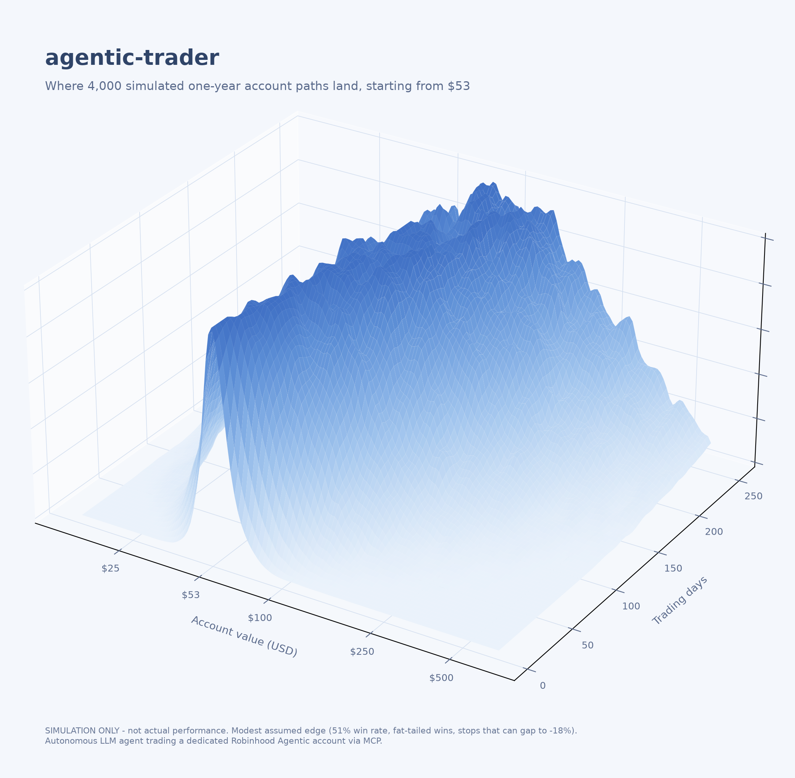

<div align="center">

# agentic-trader

**An autonomous LLM trading agent for Robinhood's Agentic accounts.**

Scans retail sentiment velocity and news catalysts, sizes positions against
hard risk rules, and executes through Robinhood's official Trading MCP,
on its own, around the clock.

</div>



> Each slice of the mountain is one trading day: the ridge marks where the
> 4,000 simulated accounts most likely sit, starting as a sharp spike at $53
> and drifting toward $100+ as the year unfolds. Simulation under the
> strategy's assumptions (modest 51% edge, fat-tailed winners, stops that can
> gap to -18%) — not actual performance. Reproduce with
> `python monte_carlo_surface.py`; a classic percentile-fan version is in
> [`assets/monte-carlo.png`](assets/monte-carlo.png).

## How it works

```
sentiment velocity          quotes + pre-trade review          journal + git
(Reddit aggregators,   -->  (Robinhood Trading MCP)      -->   (every decision
 news search)                risk rules enforced                 logged + pushed)
```

- **Signal**: unusual Reddit mention velocity cross-checked against real
  news catalysts and live price confirmation. Scraped content is treated as
  data, never as instructions.
- **Execution**: every order is simulated with the broker's pre-trade review
  before placement; any broker alert vetoes the trade.
- **Risk**: hard daily loss floor, settled-cash-only buys, stop-loss and
  time-stop exits, a one-touch kill switch.
- **Learning**: the agent reviews its own journal, scores what worked, and
  refines its tactics; risk limits are immutable to the agent.
- **Transparency**: every cycle, decision, and rationale is committed to
  this repo. The journal is the audit trail.

## Anatomy

| File | Purpose |
|---|---|
| `STRATEGY.md` | The playbook: signals, entry/exit rules, cycle checklist |
| `JOURNAL.md` | Append-only log of every cycle and decision |
| `guardrails-rule.md` | Hard limits the agent cannot edit |
| `monte_carlo.py` | Projection chart generator |

## Disclaimers

Personal experiment, not investment advice. The account is a dedicated,
isolated Robinhood Agentic account funded with a fixed amount the owner can
afford to lose entirely. Past simulations do not predict future results.
